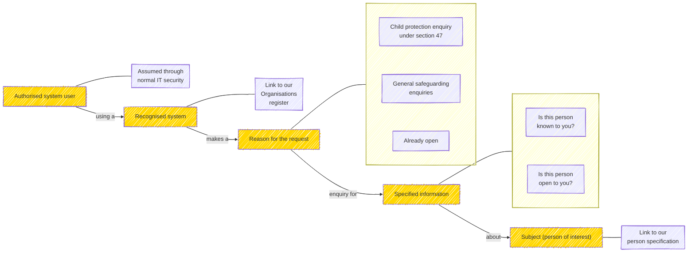

# Information governance

## Status

Version 0.1 - intial

Effective Date: 2025-10-09

This version reflects discussions from the MAIS Standards Working Group on 8th October 2025, where we reviewed the output of the earlier deep dive.

## Purpose
In order to to create a distributed Single View capability nationwide without an unmanageable burden of manual review and approval, we need to encode an **information governance framework** that can support automated machine-to-machine data sharing.

The framework must allow us to:
- Describe an existing sharing policy or agreement in a machine readable format...

    Party 1 will share X data with party 2, for purpose Y, in the context of DSA / policy / legal basis Z
- Formulate a request for information and assert that it is valid under a specific agreement
- Make a determination that a request is valid or not and respond
- Log all this activity and share relevant details for transparency, audit, etc.

## Context
We recognise this is a complex challenge. There is no overarching Data Sharing Agreement between all potential parties in a safeguarding enquiry. [Working together to safeguard children 2023 ](https://assets.publishing.service.gov.uk/media/6849a7b67cba25f610c7db3f/Working_together_to_safeguard_children_2023_-_statutory_guidance.pdf) and the [ICO guidance on sharing information to safeguard children](https://ico.org.uk/for-organisations/uk-gdpr-guidance-and-resources/data-sharing/a-10-step-guide-to-sharing-information-to-safeguard-children/) provide advice for sharing information where appropriate, including in situations where data sharing agreements or data protection impact assessments are not feasible.

We can look to examples like the Pan London Data Sharing Agreement​. One approch may be to create something similar for the partners in the distributed single view ecosystem..​

For our work today, we're making the assumption that an agreement is in place and our challenge is to encode and apply this in an automable fashion.

## Requirements

To create a trusted system of And we need to create the right conditions among partners:

- Well formed requests - The enquiry has a stated PURPOSE - using an agreed vocabulary
- Authentication and validation - we need to be able to VALIDATE that an incoming enquiry is from an approved organisation
- Authorisation - Automatable decision rules are agreed to govern data and sharing
- Logging - There is robust LOGGING of enquiries and responses, providing a clear audit trail

Draft a specification for decision rules which permit
systems to share relevant data in specific conditions
(attribute based access control)​

​

Create draft vocabularies to standardise the
reasons for a request and links to DSA​

​

Propose a technical recommendation for
implementing automated information governance

So it becomes:
Agreed decision rules - Party 1 will share X data with party 2, for purpose Y, in the context of DSA / policy Z
A pattern for making a request including the party, data requested, purpose and context (a la deep dive)
Agreed logging policy for requests and responses, including transparency and audit measures.

# Formulating a MAIS data request for automated Information Governance...

Considering a Section 47 enquiry in children's social care, which mandates that local authorities initiate enquiries when there is reasonable cause to suspect a child is suffering, or is likely to suffer, significant harm.

Our work in MAIS data exchange standards covers many other use cases, but this seemed a logical place to start.

Example: A basic s47 request at the highest level - do you know this person?

Assumptions:

- IT systems are recognised and validated, cyber security in place.
- Matching or searching systems for a person is appropriate / robust / comparable between systems (Note: Matching across Social Care is the subject of an upcoming workshop)
- All the above conditions are met.

# Next Steps

Actions:
- Define the decision rules which permit systems to share relevant data in specific conditions
- Testing if the above pattern can extend to other use cases
- Create draft vocabularies for the reasons for a request
- Propose a technical recommendation for implementing automated information governance

