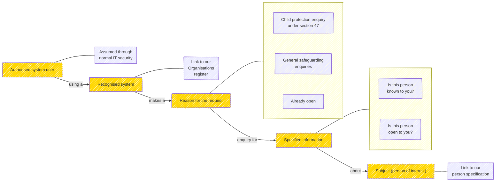

# Information governance

## Status

Version 0.1 - intial

Effective Date: 2025-10-09

This version reflects discussions from the MAIS Standards Working Group on 8th October 2025, where we reviewed the output of the earlier deep dive.

## Purpose
In order to to create a distributed Single View capability nationwide without an unmanageable burden of manual review and approval, we need to encode an **information governance framework** that can support automated machine-to-machine data sharing.

The framework must allow us to:
- Describe an existing sharing context (policy or agreement) in a machine readable format...

    Party 1 will share X data with party 2, for purpose Y, in the context of DSA / policy / legal basis Z
- Formulate a request for information and assert that it is valid under a specific context
- Make a determination that a request is valid or not and respond
- Log all this activity and share relevant details for transparency, audit, etc.

## Context
We recognise this is a complex challenge. There is no overarching Data Sharing Agreement between all potential parties in a safeguarding enquiry. [Working together to safeguard children 2023 ](https://assets.publishing.service.gov.uk/media/6849a7b67cba25f610c7db3f/Working_together_to_safeguard_children_2023_-_statutory_guidance.pdf) and the [ICO guidance on sharing information to safeguard children](https://ico.org.uk/for-organisations/uk-gdpr-guidance-and-resources/data-sharing/a-10-step-guide-to-sharing-information-to-safeguard-children/) provide advice for sharing information where appropriate, including in situations where data sharing agreements or data protection impact assessments are not feasible.

We can also look to examples like the Pan London Data Sharing Agreement​. One approch may be to create something similar for the partners in the distributed single view ecosystem. The wider MAIS programme is exploring options here.

For this initial work, in order to allow us to progress promptly to testing implementations of distributed single view capability, we focus on two contexts:

1. Section 47 in children's social care, which mandates that local authorities initiate enquiries when there is reasonable cause to suspect a child is suffering, or is likely to suffer, significant harm. In cases where a threshold has been met, there is a relatively unambiguous duty for safeguarding partners to share information.

2. Where a suitable data sharing agreement is already in place between test participants.

Our work in MAIS data exchange standards covers many other use cases. The working group discussed these on 8th October and raised a number of important points. ***TO DO: link to section below or to linked issue.*** However, we did not encounter any fundamental objection to the proposed pattern so we will review these points in parallel to testing data exchange and refine our Information Governance framework accordingly as we extend to other use cases.

## Creating the conditions for trusted, automated data sharing

To develop a robust, trusted system for automated data sharing among safeguarding partners, we need to create the right conditions:

- Authentication: we need to be able to validate that an incoming enquiry is from an approved organisation
- Well formed requests: each enquiry must have a clearly stated and recognised purpose and context
- Authorisation: Automatable decision rules are deployed to govern data sharing.
- Logging: There is robust logging of all enquiries and responses, providing a clear audit trail and insights for reporting.
- Transparency: Where it is appropriate and safe to do so, we should notify relevant parties about data sharing.

## Infomation Governance Framework components

Distilling the above into a set of deliverable components:

1. A specification for attribute based access control

    This is a set of decision rules which permit systems to share relevant data in specific conditions. It encodes the information in Data Sharing Agreements in such a way that a machine can interpret a request, check against the business rules and respsond appropriately.

    For example:
    Party 1 will share X data with party 2, for purpose Y, in the context of DSA / policy Z

2. A specification for making a request including the party, data requested, purpose and context

3. Agreed logging policy for requests and responses, including transparency and audit measures.

Draft a specification for

​

Create draft vocabularies to standardise the
reasons for a request and links to DSA​

​

A technical recommendation for implementing automated information governance

# Formulating a MAIS data request for automated Information Governance...

Considering a Section 47 enquiry in children's social care, which mandates that local authorities initiate enquiries when there is reasonable cause to suspect a child is suffering, or is likely to suffer, significant harm.

Example: A basic s47 request at the highest level - do you know this person?

Assumptions:

- IT systems are recognised and validated, cyber security in place.
- Matching or searching systems for a person is appropriate / robust / comparable between systems (Note: Matching across Social Care is the subject of an upcoming workshop)
- All the above conditions are met.

# Next Steps

Actions:
- Define the decision rules which permit systems to share relevant data in specific conditions
- Testing if the above pattern can extend to other use cases
- Create draft vocabularies for the reasons for a request
- Propose a technical recommendation for implementing automated information governance

## Standards Working Group - notes and comments
Challenges to standardising IG:
- Local practises vary - some have local rules on sharing or may wish to supress some information.
- Information sharing agreements should be national to avoid a 'postcode lottery'.
- One of the problems is that DSAs and legal bases for sharing aren't typically codified for re-use, so it's a human/paper exercise to review what's shareable or whether the use is allowable each time.
- Not 'one size fits all' - it is case dependent.

On the information being shared:
- We are focussing initially on 'involvements' for the subject of the enquiry. We recognise that other indicators provide valuable insight in safeguarding. This includes events and statuses for the individual but also indicators related to other individuals - family, household, etc.
- We recognise the value of professional to professional conversations. This solution is around helping social workers identify who to call.

On enquiries below the s47 threshold:
- A key element here is consent. This is an extra test around whether professionals have consent in order to share. What are the limitations of consent - to share with all partners or a specific subset? For how long?
- There is a gray area where social workers currently make enquiries without overtly labelling them.
- However, consent below s47 level is 'consent to receive services' or 'consent to engage' not consent for information to be shared. ICO guidance is that consent should not be used as a means for information sharing. Public task is often a better basis.

Sharing with other partners (e.g. police, education):
- Important to know how the data will be used by the recipient.
- We may need to help people understand the data they are viewing. Presentation is important.

 Technical matters:
 - For machine to machine data sharing, how do we anticipate API certificate/key management would work in a decentralised model? As we move into testing, we will develop and test approaches to this and related challenges.